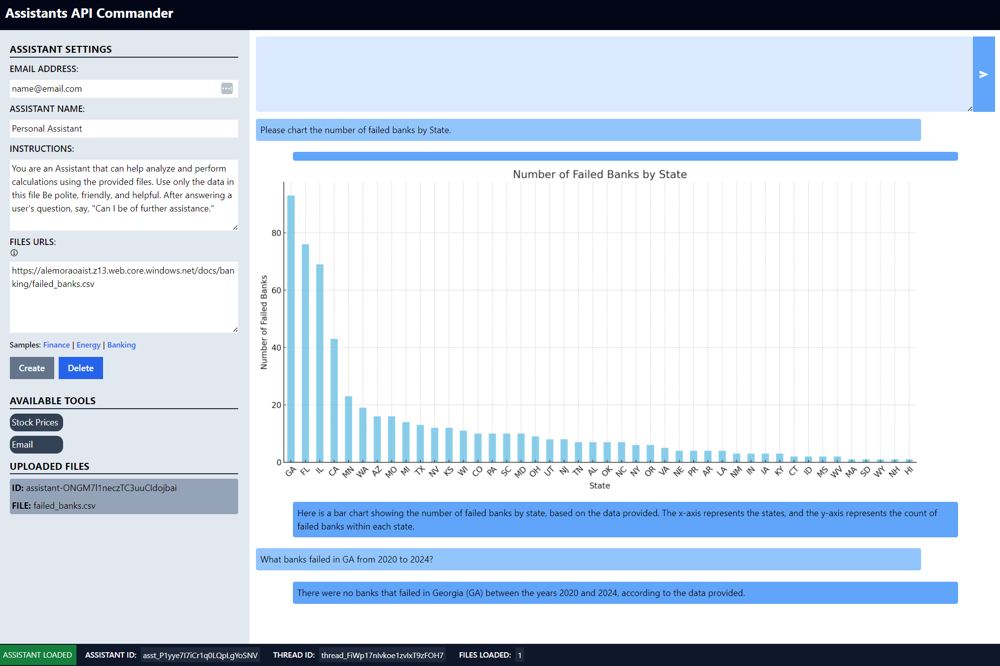

# Assistants API Commander



## Overview

Assistants API Commander is an application that was designed to help hone and solidify the Assistants API intelligent application development concepts including:

Objects

- Assistant
- Thread
- Messages
- Runs

Tools:

- Function Calling
- Code Interpreter

Lifetime event management

- Completed
- Requires action
- Etc.

Statement management

- Storing the different user Assistants, threads, and files

The application is made up of a Python FastAPI and OpenAI SDK backend, and a Vite SolidJS frontend. Generally, there would be one Assistant and multiple user Threads, but the Assistants API Commander can create one Assistant per user, each with its own set of data files. Assistants API can generate charts and graphs, and Assistants API Commander can display these images.

Generally, there would be one Assistant and multiple user Threads, but the Assistants API Commander can create one Assistant per user, each with its own set of data files. Assistants API can generate charts and graphs, and Assistants API Commander can display these images.

## Requirements

- Create an `.env` file at `src\backend`
- Add the following values:

```bash
OPENAI_URI=https://<NAME>.openai.azure.com/
BASE_URL=https://<NAME>.openai.azure.com/openai
OPENAI_KEY=<API_KEY>
OPENAI_GPT_DEPLOYMENT=<DEPLOYMENT_NAME>
```

## Frontend

- SolidJS
- Requirements:

```json
"dependencies": {
    "@solid-primitives/storage": "^2.1.2",
    "axios": "^1.6.7",
    "solid-js": "^1.8.7",
    "solid-markdown": "^2.0.0",
    "solid-spinner": "^0.2.0"
  }
```

## Backend

- Python 3.10
- [Requirements](src/backend/requirements.txt)

## Local development

Using Vscode:
- Launch the backend
  - `cd src/backend && uvicorn main:app --reload`
- Launch the frontend
  - `bun run dev` or `npm run dev`

## Running locally as a docker container with Make

- Open to [Makefile](Makefile)
- Update the following variables:
```text
TAG=0.0.5
DOCKER_PATH=am8850
DOCKER_NAME=aiassistant01
```

- Type: `make docker-run`
